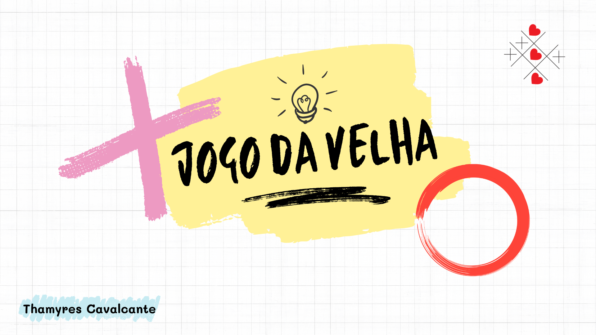

# Jogo da Velha 

  <a href="#-tecnologias">Tecnologias</a>&nbsp;&nbsp;&nbsp;|&nbsp;&nbsp;&nbsp;
   <a href="#-projeto">Projeto</a>&nbsp;&nbsp;&nbsp;|&nbsp;&nbsp;&nbsp;  
  <a href="#-Layout">Funcionalidades</a>&nbsp;&nbsp;&nbsp;|&nbsp;&nbsp;&nbsp; 
  <a href="#-Documentação">Acesso</a>&nbsp;&nbsp;&nbsp;&nbsp;&nbsp;&nbsp;    

 

## 🚀 Tecnologias

Esse projeto foi desenvolvido com as seguintes tecnologias:
- Javascript
- HTML
- CSS
- Git e Github

 

## 💻 Projeto

Projeto do jogo da velha desenvolvido com javascript, html e css.

 

## 🔨 Funcionalidades do projeto

O tabuleiro  é uma matriz  de três linhas por três colunas. Deve ter dois jogadores, cada um escolhe qual sera a sua marcação, um círculo (O) ou um xis (X). Os jogadores jogam alternadamente, uma marcação por vez, numa lacuna que esteja vazia. O objetivo é conseguir três círculos ou três xis em linha, seja horizontal, vertical ou diagonal, e ao mesmo tempo, quando possível, impedir o adversário de ganhar na próxima jogada. Quando um jogador conquista o objetivo, o programa vai colorir as lacunas com a cor verde e informar o vencedor. 
Abaixo segue um exemplo:

</img>

 

## 📁 Acesso ao projeto

É possível baixar ou acessar o código fonte do projeto atraves desse [Link.](https://github.com/Thamyresmya/Jogo_da_Velha)

 

## 🛠️ Abrir e rodar o projeto

Para utilizar o jogo basta clicar nesse [Link](https://thamyresmya.github.io/Jogo_da_Velha/) e se divertir.

 

Me siga nas redes sociais:
- [Linkedin](https://www.linkedin.com/in/thamyrescavalcante/)
- [Instagran](https://www.instagram.com/thamyres__cavalcante/)

 

---

Feito com ♥ by Thamyres Cavalcante.

